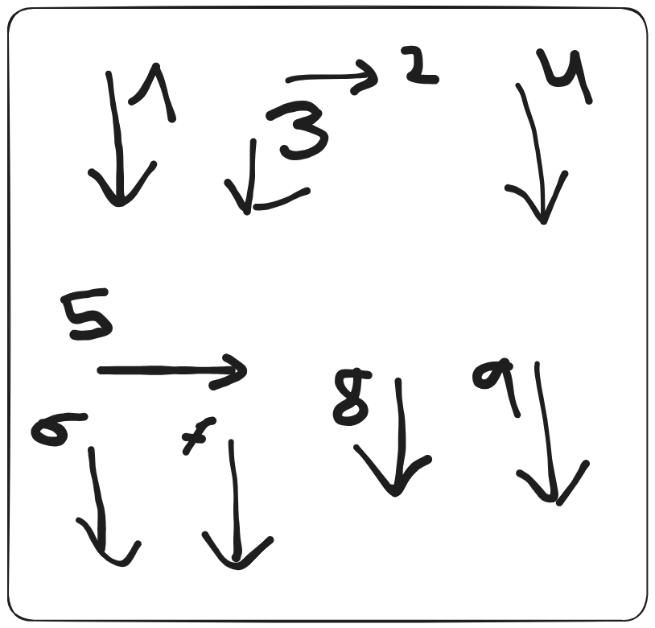

# Automated OCR and Translation Workflow: A Comparative Study Using Google Cloud Vision and Tesseract

**Judith Urbina Córdoba**  
Intern, Assemblage Tokyo  
Master's Student, Data Science, Open University of Catalonia  
[LinkedIn](https://www.linkedin.com/in/judith-urbina-cordoba/) | [GitHub](https://github.com/Yuta-chan)  

**Date:** October 2024
## Abstract

This study investigates the integration of Optical Character Recognition (OCR) and machine translation, focusing on how existing models like Google Cloud Vision and Tesseract handle the challenges of extracting and translating text from complex, multi-language documents. Most current models excel at either text recognition or translation, but not both simultaneously. This project examines the effectiveness of combining [Google Cloud Vision](https://cloud.google.com/vision?hl=en#extract-text-and-insights-from-documents-with-generative-ai) for OCR and the [Google Cloud Translation API](https://cloud.google.com/translate?hl=en) for translation, developed using Python 3, in creating an end-to-end pipeline for translating PDFs from Japanese to English.

The workflow was initially built on [Google Colab](https://colab.research.google.com/) but later transitioned to local development on Visual Studio Code for greater control over library management and API integration. Tools such as [GPT-4](https://openai.com/index/gpt-4/) and [GitHub Copilot](https://github.com/features/copilot) were used to support the development process. 

Results highlight the differences between the Google Cloud Vision API and Tesseract, particularly in the accuracy of text extraction and formatting. We also explore the challenges of automating machine translation workflows in a cost-effective and scalable manner.

The complete code implementation is available in my [GitHub repository](https://github.com/Yuta-chan/ocr-translation-automation-jap-to-en). This research opens pathways to further exploration of cost-effective, automated OCR and translation models that could be applied in industries requiring multi-language document handling, such as film production, data management, and international business communication.

**Keywords**: Optical Character Recognition (OCR), machine translation, Google Cloud Vision, Tesseract, Python, Google Colab, AI development, cloud computing, document processing.

# Introduction

## Context and Motivation

This project was intended to be the solution to a tool that my boss at my internship wanted. Although he, a foreigner, can speak and understand formal spoken Japanese, he does not know how to read or write Japanese. He received some instructions in a storyboard for one of his current projects. However, he did not understand them, and even when he uploaded the PDF file to [Google Translate](https://translate.google.com/?sl=ca&tl=en&op=translate), it did not provide accurate results.

I verified this myself, and the PDF was larger than 10 MB, which is the limit for uploading. Although I compressed the PDF to fit the 10 MB limit, this did not solve the problem of simplifying his workflow.


The challenges I addressed with OCR and translation automation were to research and decide:
- How the automation would be deployed (whether as a website, remote server, browser plug-in, or as a file on a computer).
- How the PDF to be translated would be selected (either with input from the user with or without a GUI interface, or automatically detecting the targeted files).
- How to minimize the costs, avoid paid subscriptions, and understand the billing usages and costs for AI model APIs.

| Tool        | Purpose                          | Cost       |
|-------------|----------------------------------|------------|
| Google Cloud Vision | OCR (Text Detection)         | Pay-per-use |
| Tesseract   | OCR (Text Detection)         | Free        |
| Google Translate API | Language Translation         | Pay-per-use |

**Table 1: Comparison of OCR and Translation tools with their purposes and costs.**

# Literature Review

## Research of Existing Solutions

To find existing OCR tools, which I did not initially know by name, I searched through popular online communities to find answers to questions that had already been asked, such as:

| Website | Notes              | Reference                                                                                                                                                                |
| ------- | ------------------ | ------------------------------------------------------------------------------------------------------------------------------------------------------------------------ |
| Reddit  | NAPS2 is an app     | [NAPS2 Tesseract](https://www.reddit.com/r/datacurator/comments/11roy7u/ocr_software_that_works/)                                                                        |
| Klippa  | Apps and libraries  | [Office Lens, Tesseract, OCR.space, New OCR](https://www.klippa.com/en/blog/information/best-ocr-software/)                                                              |
| Medium  | With Python         | [Amazon Textract, Tesseract, GOCR, Keras-OCR, Doctr, EasyOCR](https://medium.com/@erkajalkumari/the-top-10-python-ocr-libraries-for-extracting-text-from-images-84987fe0d58f) |

**Table 2: Summary of resources and discussions found in online communities regarding OCR tools.**

While some tools, such as Amazon Textract, showed promise, they required credentials for access, which added complexity to the setup process.
# Methodology: Part 1

## Technical Workflow: Google Cloud Vision vs. Tesseract

### Initial Setup

I initially chose Google Cloud Vision due to its ease of integration. I already had a developer's account on Google Cloud, and after reviewing feedback from others who had compared Tesseract and Google Vision, such as [Ellen Schellekens](https://medium.com/ixor/comparing-tesseract-ocr-with-google-vision-ocr-for-text-recognition-in-invoices-bddf98f3f3bd), it was clear that Tesseract performed worse in terms of accuracy compared to Google Cloud Vision. Additionally, setting up the Google Cloud Vision API (by finding and enabling it in the API Library on Google Cloud) was simpler and required fewer additional tools than installing a library like Tesseract.

What led me to experiment with Tesseract was the fact that, while Google Vision successfully scanned the text, the output was poorly formatted. The text was returned as plain text, with no formatting, meaning you had to determine where on the PDF page (now an image) the detected text corresponded. From the perspective of a Latin-speaker, locating Japanese characters on a screen was cumbersome. In contrast, Tesseract returned text with indentations, making it easier for users to understand the placement of the text.

### Setup Google Cloud Vision

#### Setup Google Cloud Services

I followed the instructions from the official [Google Cloud Vision documentation](https://cloud.google.com/vision/docs/setup). While it provides a step-by-step guide, some parts may be difficult for first-time users to understand. I’ll explain the most relevant steps.

One of the most troublesome parts is that even for a free trial of Google Cloud Services, a payment profile is required, which means providing a location and a payment method.


*Figure 1: Creating a new Google Cloud project.*


*Figure 2: Navigating the Google Cloud Console.*

Apart from setting up the payment profile, you need to authenticate yourself using [access credentials](https://developers.google.com/workspace/guides/create-credentials). There are currently three types of authentication methods:


*Figure 3: Authentication methods available for Google Cloud Services.*

Since we needed to provide files to the models, and considering my internship company might use this in the future, I created a service account access credential.

The steps are as follows:
1. Create a new project from [this link](https://console.cloud.google.com/projectselector2/iam-admin/serviceaccounts?supportedpurview=project).
2. Once the project is selected, go to *Service Accounts* and create a new service account.


*Figure 4: Creating a service account in Google Cloud.*

3. Assign the role of "Owner" to the service account to simplify management (since I was the only user, I skipped the optional third step).

Finally, you need to add a key to the service account to obtain the JSON file required for every API call to Google Cloud models. To do this, navigate to the *Manage Keys* section and create a new key, selecting JSON format.


*Figure 5: Adding a key to the service account.*

It’s important to keep the path to the generated JSON file, as it is the key. Also, remember to note the project ID and location within Google Cloud.

Since we intend to use machine learning models, we can enable the Cloud Translation API and Cloud Vision API from the *Machine Learning* category in the API library.

Next, install the [gcloud client library](https://cloud.google.com/sdk/docs/install) for easier access. After installing it in the same folder where your Python files are stored, initialize the Google Cloud CLI. During the setup, you’ll be asked to provide a configuration name and the Gmail account linked to your Google Cloud account.


*Figure 6: Initializing the Google Cloud CLI.*

After that, you’ll be asked to select the cloud project you want to use.

#### Setup Google Cloud Vision & Cloud Translation API

Once the Google Cloud Service setup is complete, the next step is to enable all necessary APIs from the API library within Google Cloud Products. You can install the versions of the models of interest via the terminal.


*Figure 7: Enabling APIs in Google Cloud.*

### Setup Tesseract

To install and configure Tesseract on my local environment, I followed the steps outlined on the official [Tesseract website](https://github.com/tesseract-ocr/tesseract). One important point to note is that for every language you want to use, you must install a specific language data file, even for English.

Since my computer runs Ubuntu 22.04, the steps were as follows:

1. Add the Tesseract Personal Package Archive (PPA):
   ```bash
   sudo add-apt-repository ppa:alex-p/tesseract-ocr-devel
   sudo apt update
```

2. Install the Tesseract OCR engine:

   ```bash
   sudo apt install tesseract-ocr
```

3. Install the Japanese and English language packs:

   ```bash
   sudo apt install tesseract-ocr-jpn
   sudo apt install tesseract-ocr-eng
```

Tesseract is now ready to be used locally for text recognition, and it allows for more readable output with better formatting for the text detected from images or PDFs.

# Methodology Part 2

## Transition to Local Development and GitHub Copilot

### Google Colab Setup

I initially used Google Colab because my working computer was not my personal machine but a MacOS device with the following specifications:


This computer did not have any programming-related tools installed, but instead had video and photography editing software such as DaVinci Resolve Studio 19. 

Additionally, since the goal was to develop a solution that my boss could apply directly using his accounts or computer, I thought about using a cloud service like Colab. My approach involved transitioning between my business account and his account by sharing notebooks, which allowed us to develop an interactive notebook to handle the task. This approach came after discarding tools like Zapier or similar automation platforms.


*Figure 1: A non-suitable programming framework setup for a beginner.*

### Local Development and GitHub Copilot

I moved to a local setup to simplify the authentication steps with Google Cloud and to avoid the constant switching between my account and my boss's account, thus stabilizing the development framework. By working locally on my computer, I was able to subscribe to [GitHub Copilot](https://github.com/features/copilot) in Visual Studio Code and use GPT-4 without much effort.

I also installed all the required libraries using virtual environments with [venv](https://docs.python.org/3/library/venv.html), following the official documentation. This allowed me to better control the dependencies and development environment.

# Results

## Selected Case Study

One of the PDFs selected for translation was the following:

.pdf)

We chose this PDF to be translated into English.

## Results from Tesseract

Since Tesseract processes images[^1], one page of the PDF was exported to PNG, specifically under the name `test-image.png`.

[^1]: Tesseract supports **[various image formats](https://tesseract-ocr.github.io/tessdoc/InputFormats)** including PNG, JPEG, and TIFF.


This image was OCR-scanned with the language set to Japanese, and the output was saved in the file `output.txt`. The command used was:

```bash
tesseract test-image.png output -l jpn
```

## Results from Google Cloud Vision

After processing the entire PDF with Google Cloud Vision, the resulting non-translated text file was exported as a PDF:


Note that the highlighted green areas come from a `ctrl+F` search.

### Comparing Values & Mistakes

To compare the results, I used [CharacterCounter](https://charactercounter.com/japanese-character-counter) to count the number of Japanese characters (across its three alphabets) and English words in the output. The platform also provided an estimate of Japanese words, which is included in the comparison below:

|AI Model|Jap Total|Hiragana|Katakana|Kanji|English|Japanese Words|Errors|
|---|---|---|---|---|---|---|---|
|Tesseract|566|238|149|129|66|114|1|
|Google Cloud Vision|583|253|149|130|69|117|9|

The errors I found in the Tesseract output, by comparing it manually, are marked in the following PDF:


In the Google Cloud Vision output, I highlighted the text contained within the drawing of the girl, as shown below:


# Discussion

## Comparison of Results

One of the main drawbacks of using Google Cloud Vision was that the text recovered from the PDF lacked indentation (i.e., proper formatting), which was due to my implementation of Cloud Vision. Additionally, the order in which the scanned text appeared in the output differed between the two models.

In the Google Cloud Vision output, the text appeared in the following order:



In contrast, the Tesseract output followed this path:


The path followed by the Tesseract model demonstrates the use of the [Sliding Window](https://medium.com/@Data_Aficionado_1083/object-detection-sliding-window-r-cnn-fast-r-cnn-faster-r-cnn-f47c7dbe003d) algorithm for object detection. In contrast, the Google Cloud Vision model did not follow as straightforward a path.

In addition to this, the key difference between the output of the two models was the accuracy in detecting the text over the image of the girl. While Tesseract was only able to detect that there was some content present, Google Cloud Vision managed to detect the entire paragraph and even identified "IKEA" (although with a misspelling) within the red box.

As for the character count, the difference in the number of characters detected can largely be attributed to whether the text within the image of the girl was detected or not.

On the other hand, the biggest disadvantage of Google Cloud Vision is its complex setup process. Furthermore, its accuracy comes at a cost, as it is not a free service like Tesseract. However, Tesseract's OCR scanning was sufficiently accurate for most purposes, unless a highly precise output is required.
# Future Work

## Potential Improvements

Moving forward, I would suggest the following improvements to the project:

1. Enhance the code to improve output formatting, particularly for the Cloud Vision implementation, so that the content in the `.txt` file respects the logical order in which the text appears in the image.
2. Test other versions of Google Cloud Vision and Tesseract to compare performance and output quality.
3. Test and compare the results from Google Cloud Vision with other paid OCR services, such as Amazon's [Textract](https://aws.amazon.com/textract/).
4. Equip the code with a GUI interface to make it more user-friendly and consider deploying the app for easier access.
5. Implement functionality to place the translated text in the same position as the original text within the document.
# Conclusions

Automating the process of scanning a document, such as a PDF, translating the text, and then recovering the document with the translated text is not an easy task, even for AI models. One must take into account several limitations, such as the number of pages the model can process in a single call, the balance between accuracy, quality, and cost depending on the use case, the complexity of the setup, and even the storage that the process will consume.

In the end, Google Cloud Vision provided better results than Tesseract for OCR scanning. However, regarding translation, even though the Google Translation API is proven to translate text well, without properly rearranging the scanned text into coherent sentences, the output does not provide the desired feedback.

It is also important to note that the GitHub repository for this project does not currently include the implementation of the Tesseract part, as the focus has primarily been on the Google Cloud Vision and Translation API integration.
# References

- Amazon Textract, Tesseract, GOCR, Keras-OCR, Doctr, EasyOCR. Retrieved from https://medium.com/@erkajalkumari/the-top-10-python-ocr-libraries-for-extracting-text-from-images-84987fe0d58f
- CharacterCounter. Retrieved from https://charactercounter.com/japanese-character-counter
- Documentation. Retrieved from https://cloud.google.com/vision/docs/setup
- Ellen Schellekens. Retrieved from https://medium.com/ixor/comparing-tesseract-ocr-with-google-vision-ocr-for-text-recognition-in-invoices-bddf98f3f3bd
- Gcloud client library. Retrieved from https://cloud.google.com/sdk/docs/install
- GitHub Copilot. Retrieved from https://github.com/features/copilot
- Google Cloud Translation API. Retrieved from https://cloud.google.com/translate?hl=en
- Google Cloud Vision. Retrieved from https://cloud.google.com/vision?hl=en#extract-text-and-insights-from-documents-with-generative-ai
- Google Colab. Retrieved from https://colab.research.google.com/
- Google Translate. Retrieved from https://translate.google.com/?sl=ca&tl=en&op=translate
- GPT-4. Retrieved from https://openai.com/index/gpt-4/
- Here. Retrieved from https://console.cloud.google.com/projectselector2/iam-admin/serviceaccounts?supportedpurview=project
- NAPS2 Tesseract. Retrieved from https://www.reddit.com/r/datacurator/comments/11roy7u/ocr_software_that_works/
- Office Lens, Tesseract, OCR.space, New OCR. Retrieved from https://www.klippa.com/en/blog/information/best-ocr-software/
- Sliding Window. Retrieved from https://medium.com/@Data_Aficionado_1083/object-detection-sliding-window-r-cnn-fast-r-cnn-faster-r-cnn-f47c7dbe003d
- Tesseract. Retrieved from https://tesseract-ocr.github.io/
- Textract. Retrieved from https://aws.amazon.com/textract/
- Venv. Retrieved from https://docs.python.org/3/library/venv.html
- Various image formats. Retrieved from https://tesseract-ocr.github.io/tessdoc/InputFormats
- Website. Retrieved from https://github.com/tesseract-ocr/tesseract
- Access credentials. Retrieved from https://developers.google.com/workspace/guides/create-credentials